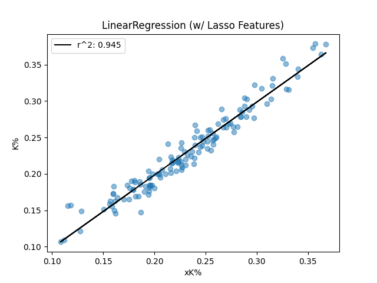
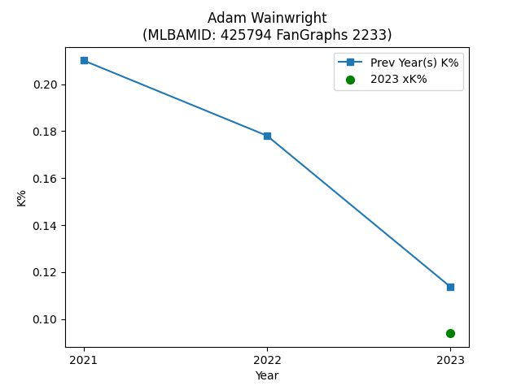
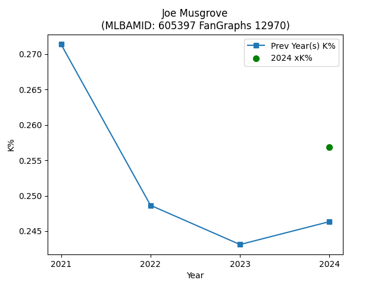
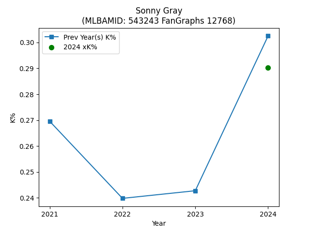
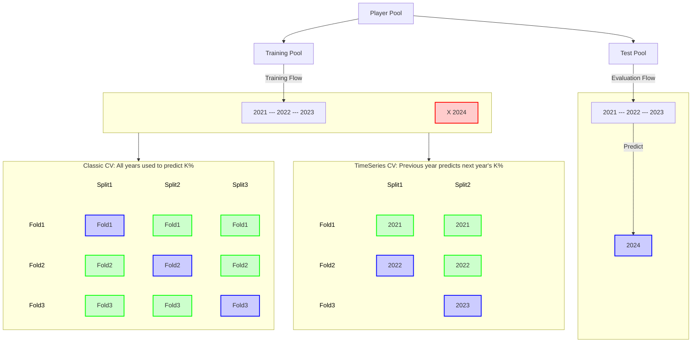

# mlb-pitcher-xK

## Problem
The provided `k.csv` file in `data/` contains only eight columns:
1. `MLBAMID`: player's MLB ID
1. `PlayerId`: player's FanGraphs ID
1. `Name`: player's name
1. `Team`: player's team name (**NOTE**: `" - - -"` if the player played on multiple teams in a season)
1. `Age`: player's age in 2024 season
1. `Season`: season year
1. `TBF`: Total batters faced for this player-season
1. `K%`: Strikeout percentage for this player-season

**Instructions:**
Predict each player's strikeout percentage in the 2024 season
given his total batters faced and strikeout percentage in prior seasons.
You are definitely not required to do so, but if you wish, you are welcome to research
and incorporate more data than what is provided in the `k.csv` file for your predictions.
However, **you may not include any data from Opening Day for the 2024 regular season onward**.
For example, you may include each player's fastball velocity in prior seasons if you can find that data
and think it will help your prediction, but you cannot include each player's 2024 fastball velocity.
Data in `k.csv` came from fangraphs.com. Your analysis should be completely reproducible.

## Results
A linear model was fit using the provided `k.csv` data and supplemental data found at [Baseball Reference Pitcher Data](https://www.baseball-reference.com/leagues/majors/2024-pitches-pitching.shtml). The model used `7` features:

- `I/Str`: ball in play percentage (balls put into play including hr / total strikes)
- `Pit/PA`: pitches per plate appearance
- `Con`: contact percentage ((foul + inplay strikes) / (inplay + foul + swinging strikes))
- `30%`: 3-0 count seen percentage (3-0 counts / PA)
- `L/SO`: strikeouts looking
- `F/Str`: foul ball strike percentage (pitches fouled off / total strikes seen)
- `Str%`: strike percentage (strikes / total pitches; intentional balls included)

The coefficients (weights) of the model are below:
| feature   |         coef |
|:----------|-------------:|
| I/Str     | -0.0528688   |
| Pit/PA    | -0.0143233   |
| Con       | -0.0124488   |
| 30%       | -0.00476233  |
| L/SO      |  0.00440924  |
| F/Str     | -0.00169988  |
| Str%      | -0.000350969 |

The model performed well when comparing the actual strike out percentage (`K%`) to the expected strike out percentage (`xK%`):


### For an interactive plot, see [assets/images/linear-pred-vs-target.html](assets/images/linear-pred-vs-target.html)

A few cool plots based on the predictions:







## References
- [The Definitive Pitcher Expected K% Formula](https://fantasy.fangraphs.com/the-definitive-pitcher-expected-k-formula/)
- [TensorFlow Time series forecasting](https://www.tensorflow.org/tutorials/structured_data/time_series)
- [Baseball Reference Pitcher Data](https://www.baseball-reference.com/leagues/majors/2014-pitches-pitching.shtml)

## Development Process
Development was performed in Jupyter notebooks (see the [notebooks/](./notebooks) directory).
An accompanying package, `bullpen`, was created to take the final state of code from the notebooks
and convert it to source code (see the [src/bullpen/](./src/bullpen/) directory).

> [!IMPORTANT]
> These are likely the files you want to look at to familiarize yourself with the analysis.

- [00-data-scrape-example.ipynb](./notebooks/00-data-scrape-example.ipynb)
- [01a-data-processing-fixing-names.ipynb](./notebooks/01a-data-processing-fixing-names.ipynb)
- [01b-data-processing-merging.ipynb](./notebooks/01b-data-processing-merging.ipynb)
- [02-data-partitioning.ipynb](./notebooks/02-data-partitioning.ipynb)
- [03-feature-engineering.ipynb](./notebooks/03-feature-engineering.ipynb)
- [04a-modeling-classic-cv.ipynb](./notebooks/04a-modeling-classic-cv.ipynb)
- [04b-modeling-time-series-cv.ipynb](./notebooks/04b-modeling-time-series-cv.ipynb)
- [05-final-predictions.ipynb](./notebooks/05-final-predictions.ipynb)


## Scraping Supplementary Pitching Data from Baseball Reference

The provided dataset (`k.csv`) located in the `data/` directory contains essential but limited pitching statistics, with the following eight columns:

1. **`MLBAMID`**: Player's MLB ID
2. **`PlayerId`**: Player's FanGraphs ID
3. **`Name`**: Player's name
4. **`Team`**: Player's team name (*Note*: `" - - -"` indicates the player played for multiple teams in a season)
5. **`Age`**: Player's age during the 2024 season
6. **`Season`**: Year of the season
7. **`TBF`**: Total batters faced for the player-season
8. **`K%`**: Strikeout percentage for the player-season

To make accurate predictions of a pitcher's strikeout percentage (`K%`) for the 2024 season, additional contextual data will likely be required. Fortunately, Baseball Reference offers a comprehensive dataset of MLB pitching statistics: [Baseball Reference Pitching Data](https://www.baseball-reference.com/leagues/majors/2021-pitches-pitching.shtml).

### Scraping Utility
To facilitate data collection, a scraping utility has been implemented:
- **`bullpen.data_utils.Scraper()`**: A core scraping tool for Baseball Reference data.
- **`bullpen.data_utils.batch_scrape()`**: A convenience function to scrape data across multiple seasons.

Since the dataset in `k.csv` covers the seasons from 2021 to 2024, we will limit our scraping to this same range.

---

## Supplemental Data Attributes

The Baseball Reference data contains the following additional attributes, which provide deeper insights into a pitcher's performance:

1. **`Rk`**: Arbitrary rank based on sorting
2. **`Name`**: Player's name
3. **`Age`**: Age as of June 30th of the season year
4. **`Tm`**: Abbreviated team name
5. **`IP`**: Innings pitched
6. **`PA`**: Number of plate appearances (including inning-ending baserunning outs)
7. **`Pit`**: Total pitches in plate appearances
8. **`Pit/PA`**: Pitches per plate appearance
9. **`Str`**: Total strikes (including both in-zone and out-of-zone swings)
10. **`Str%`**: Strike percentage (`Str / Pit`)
11. **`L/Str`**: Looking strike percentage (`Looking strikes / Str`)
12. **`S/Str`**: Swinging strike percentage (`Swinging strikes / Str`)
13. **`F/Str`**: Foul strike percentage (`Fouls / Str`)
14. **`I/Str`**: Balls in play percentage (`Balls in play / Str`)
15. **`AS/Str`**: Percentage of strikes swung at (`(In-play + Fouls + Swings) / Str`)
16. **`I/Bll`**: Intentional ball percentage (`Intentional balls / Total balls`)
17. **`AS/Pit`**: Swing percentage (`Swings / (Pit - Intentional balls)`)
18. **`Con`**: Contact percentage (`(Fouls + In-play) / Swings`)
19. **`1st%`**: First pitch strike percentage (`First-pitch strikes / PA`)
20. **`30%`**: Percentage of 3-0 counts seen (`3-0 counts / PA`)
21. **`30c`**: Total 3-0 counts
22. **`30s`**: Strikes in 3-0 counts
23. **`02%`**: Percentage of 0-2 counts seen (`0-2 counts / PA`)
24. **`02c`**: Total 0-2 counts
25. **`02s`**: Strikes in 0-2 counts
26. **`02h`**: Hits allowed in 0-2 counts
27. **`L/SO`**: Strikeouts looking
28. **`S/SO`**: Strikeouts swinging
29. **`L/SO%`**: Looking strikeout percentage (`Looking SO / Total SO`)
30. **`3pK`**: Three-pitch strikeouts
31. **`4pW`**: Four-pitch walks
32. **`PAu`**: Plate appearances with unknown outcomes
33. **`Pitu`**: Pitches with unknown ball-strike results
34. **`Stru`**: Strikes with unknown details
35. **`Season`**: Year of the season

## Data Partitioning Strategy


Inspired by scikit-learn:
- https://scikit-learn.org/stable/modules/cross_validation.html
- https://scikit-learn.org/1.5/modules/cross_validation.html#time-series-split

## Project Layout
The full layout of the project is shown below -- notably:
- `data/`: Location of any provided or collected dataset
    - `k.csv`: original provided data
    - `player_ids.json`: A collection of Name to ID mappings (used by `bullpen.data_utils.PlayerLookup`).
    - `supplemental-stats.csv`: Scraped data from [Baseball Reference Pitcher Data](https://www.baseball-reference.com/leagues/majors/2014-pitches-pitching.shtml)
    - `train.csv` and `test.csv`: saved model training and test data after merging `k.csv` and `supplemental-stats.csv` together (see [02-data-partitioning.ipynb](./notebooks/02-data-partitioning.ipynb)).
- `models/`: Model registry that contains trained model files.
- `notebooks/`: Development notebooks that contain data preprocessing, feature engineering, and modeling
   ideation and implementation.
    - For source code that implements the ideas in `notebooks`, see [`src/bullpen/mle_project`](./scr/bullpen) files
    - The `notebooks/html/` directory holds HTML versions of the Jupyter Notebooks.
- `src/`: Source code
- `tests/`: Unit test suite
```
$ tree
.
├── LICENSE
├── README.html
├── README.md
├── articles
│   └── The Definitive Pitcher Expected K% Formula _ RotoGraphs Fantasy Baseball.pdf
├── assets
│   └── images
│       ├── gray-pred.png
│       ├── grid_search_cross_validation.png
│       ├── linear-pred-vs-target.html
│       ├── linear-pred-vs-target.png
│       ├── musgrove-pred.png
│       ├── time-series-cv.png
│       └── wainwright-pred.png
├── data
│   ├── k.csv
│   ├── player_ids.json
│   ├── supplemental-stats.csv
│   ├── test.csv
│   └── train.csv
├── models
│   ├── linear.joblib
│   ├── randomforest.joblib
│   └── xgboost.joblib
├── notebooks
│   ├── 00-data-scrape-example.ipynb
│   ├── 01a-data-processing-fixing-names.ipynb
│   ├── 01b-data-processing-merging.ipynb
│   ├── 02-data-partitioning.ipynb
│   ├── 03-feature-engineering.ipynb
│   ├── 04a-modeling-classic-cv.ipynb
│   ├── 04b-modeling-time-series-cv.ipynb
│   ├── 05-final-predictions.ipynb
│   └── scratch.ipynb
├── pyproject.toml
├── src
│   └── bullpen
│       ├── __init__.py
│       ├── cv_utils.py
│       ├── data_utils.py
│       ├── model_utils.py
│       └── plot_utils.py
└── tests
    ├── __pycache__
    │   └── test_data_utils.cpython-311-pytest-8.3.4.pyc
    └── test_data_utils.py
```

## Installation
- Create a virtual environment (with Python 3.11+)
- Activate the virtual environment
- Clone the repo: `git clone git@github.com:loganthomas/mlb-pitcher-xK.git`
- Navigate to the project directory: `cd mlb-pitcher-xK`)
- Install local version via `pip install -e .`

```
$ python3 -V
Python 3.11.9

$ python3 -m venv ~/venvs/clover-env

$ source ~/venvs/clover-env/bin/activate

$ cd mle-project

$ pip install -e .
```

- Optional step: run test suite
```
$ pytest .
=========================================================== test session starts ===========================================================
platform darwin -- Python 3.11.9, pytest-8.3.2, pluggy-1.5.0
rootdir: /Users/logan/Desktop/repos/mle-project
configfile: pytest.ini
plugins: cov-5.0.0, anyio-4.4.0, subtests-0.13.1
collected 14 items

tests/test_data_utils.py .........                                                                                                  [ 64%]
tests/test_models.py .....                                                                                                          [100%]

---------- coverage: platform darwin, python 3.11.9-final-0 ----------
Name                             Stmts   Miss  Cover   Missing
--------------------------------------------------------------
src/mle_project/__init__.py          1      0   100%
src/mle_project/data_utils.py       58      0   100%
src/mle_project/file_utils.py        4      0   100%
src/mle_project/model_utils.py     139     79    43%   101-102, 125-132, 158-181, 187-202, 219-234, 261-276, 286-339, 343
tests/test_data_utils.py            93      0   100%
tests/test_models.py                83      0   100%
--------------------------------------------------------------
TOTAL                              378     79    79%


=========================================================== 14 passed in 12.06s ===========================================================
```
