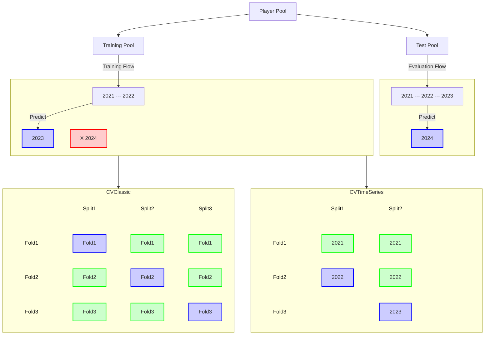

# mlb-pitcher-xK

## Problem
The provided `k.csv` file in `data/` contains only eight columns:
1. `MLBAMID`: player's MLB ID
1. `PlayerId`: player's FanGraphs ID
1. `Name`: player's name
1. `Team`: player's team name (**NOTE**: `" - - -"` if the player played on multiple teams in a season)
1. `Age`: player's age in 2024 season
1. `Season`: season year
1. `TBF`: Total batters faced for this player-season
1. `K%`: Strikeout percentage for this player-season

**Instructions:**
Predict each player's strikeout percentage in the 2024 season
given his total batters faced and strikeout percentage in prior seasons.
You are definitely not required to do so, but if you wish, you are welcome to research
and incorporate more data than what is provided in the `k.csv` file for your predictions.
However, **you may not include any data from Opening Day for the 2024 regular season onward**.
For example, you may include each player's fastball velocity in prior seasons if you can find that data
and think it will help your prediction, but you cannot include each player's 2024 fastball velocity.
Data in `k.csv` came from fangraphs.com. Your analysis should be completely reproducible.

## Notebooks
Copy and paste url here to see interactive plotly graphs: https://nbviewer.org/

## References
- [The Definitive Pitcher Expected K% Formula](https://fantasy.fangraphs.com/the-definitive-pitcher-expected-k-formula/)
- [TensorFlow Time series forecasting](https://www.tensorflow.org/tutorials/structured_data/time_series)
- [Baseball Reference Pitcher Data](https://www.baseball-reference.com/leagues/majors/2014-pitches-pitching.shtml)

## Data Partitioning Strategy

Inpsired by sklearn:
- https://scikit-learn.org/stable/modules/cross_validation.html
- https://scikit-learn.org/1.5/_images/grid_search_cross_validation.png
- https://scikit-learn.org/1.5/modules/cross_validation.html#time-series-split

## Supplemental Data
- 'Rk': arbitrary sorting rank based on selected column
- 'Name': player name
- 'Age': player age at midnight on June 30th of season year
- 'Tm': abbreviated team name
- 'IP': innings pitched
- 'PA': number of plate appearances for which pitch-by-pitch data exists
-       (note that inning-ending baserunning outs are counted as a PA, so these may be larger than batting PAs)
- 'Pit': number of pitches in the PA
- 'Pit/PA': pitches per plate appearance
- 'Str': strikes (includes both pitches in the zone and those swung at out of the zone)
- 'Str%': strike percentage (strikes / total pitches; intentional balls included)
- 'L/Str': looking strike percentage (strikes looking / total strikes)
- 'S/Str': swinging strike percentage (swinging strikes w/o contact / total strikes)
- 'F/Str': foul ball strike percentage (pitches fouled off / total strikes seen)
- 'I/Str': ball in play percentage (balls put into play including hr / total strikes)
- 'AS/Str': swung at strike percentage ((inplay + foul + swinging strikes) / total strikes)
- 'I/Bll': intentional ball percentage (intentional balls / all balls)
- 'AS/Pit': percentage of pitches swung at ((inplay + foul + swinging strikes) / (total pitches - intentional balls))
- 'Con': contact percentage ((foul + inplay strikes) / (inplay + foul + swinging strikes))
- '1st%': first pitch strike percentage (percent of play appearances being with 0-1 or with a ball inplay
- '30%': 3-0 count seen percentage (3-0 counts / PA)
- '30c': 3-0 counts seen
- '30s': 3-0 count strikes
- '02%': 0-2 count seen percentage (0-2 counts / PA)
- '02c': 0-2 counts seen
- '02s': 0-2 count strikes
- '02h': hits given up on an 0-2 count
- 'L/SO': strikeouts looking
- 'S/SO': strikeouts swinging
- 'L/SO%': strikeout looking percentage (stikeouts looking / all strikeouts)
- '3pK': 3 pitch strikeouts
- '4pW': 4 pitch walks
- 'PAu': Plate appearances for which data is unknown
- 'Pitu': Pitches for which ball-strike results are unknown
- 'Stru': Strikes for which detailed results are unknown
- 'Season': Year of stats
