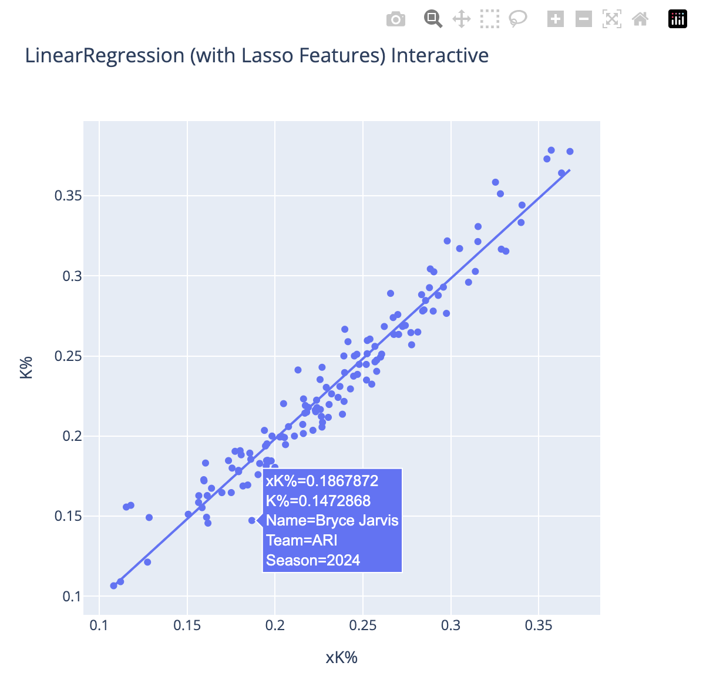

# mlb-pitcher-xK

## Overview
`mlb-pitcher-xK` is a data science and machine learning project
focused on predicting MLB pitchers' strikeout percentages (`K%`)
for the 2024 season. Using historical pitching data, feature engineering,
and statistical modeling, this project aims to derive insights into
pitcher performance trends while emphasizing reproducibility
and employing best practices in data science.

## Problem Statement
The provided dataset in `data/k.csv` contains only eight columns:
1. `MLBAMID`: player's MLB ID
1. `PlayerId`: player's FanGraphs ID
1. `Name`: player's name
1. `Team`: player's team name (_NOTE_: `" - - -"` indicates the player played for multiple teams in a season)
1. `Age`: player's age in 2024 season
1. `Season`: season year
1. `TBF`: Total batters faced for the player-season
1. `K%`: Strikeout percentage for the player-season

**Objective**: Predict each player’s `K%` for the 2024 season using historical `K%` and other derived features.
The analysis excludes any data from Opening Day 2024 onward.

## Results
A linear regression model (`LinearRegression`) and two tree-based models (`XGBRegressor` and `RandomForestRegressor`) were developed using:
- Provided data (`k.csv`): historical `K%` and `TBF` values
- Supplemental data: Scraped statistics from [Baseball Reference Pitcher Data](https://www.baseball-reference.com/leagues/majors/2024-pitches-pitching.shtml),
including advanced metrics like strike percentages and contact rates.

#### 2024 Predictions
|          model        |    R2  |    MSE   |
|:----------------------|:------:|:--------:|
| LinearRegression      | 0.945  | 0.00018  |
| XGBRegressor          | 0.935  | 0.00021  |
| RandomForestRegressor | 0.926  | 0.00024  |

> [!IMPORTANT]
> The LinearRegression model was chosen as the final model architecture.

### Key Features Used by the Model
- `I/Str`: ball in play percentage (balls put into play including hr / total strikes)
- `Pit/PA`: pitches per plate appearance
- `Con`: contact percentage ((foul + inplay strikes) / (inplay + foul + swinging strikes))
- `30%`: 3-0 count seen percentage (3-0 counts / PA)
- `L/SO`: strikeouts looking
- `F/Str`: foul ball strike percentage (pitches fouled off / total strikes seen)
- `Str%`: strike percentage (strikes / total pitches; intentional balls included)

| feature   |         coef |
|:----------|-------------:|
| I/Str     | -0.0528688   |
| Pit/PA    | -0.0143233   |
| Con       | -0.0124488   |
| 30%       | -0.00476233  |
| L/SO      |  0.00440924  |
| F/Str     | -0.00169988  |
| Str%      | -0.000350969 |

### Model Performance
The model effectively predicts `xK%` (expected strikeout percentage),
as demonstrated by the correlation between predicted and actual `K%`:


### For an interactive visualization, see [assets/images/linear-pred-vs-target.html](assets/images/linear-pred-vs-target.html):



A few cool plots based on the predictions:


## References
- [The Definitive Pitcher Expected K% Formula](https://fantasy.fangraphs.com/the-definitive-pitcher-expected-k-formula/)
- [TensorFlow Time series forecasting](https://www.tensorflow.org/tutorials/structured_data/time_series)
- [Baseball Reference Pitcher Data](https://www.baseball-reference.com/leagues/majors/2014-pitches-pitching.shtml)

## Development Process
All analysis and modeling were conducted in Jupyter notebooks (see the [notebooks/](./notebooks) directory).
The final code was refactored into a Python package, `bullpen`, for modularity and reproducibility
(see [src/bullpen/](./src/bullpen/)). Key development steps include:
1. **Data Scraping**: Extracted supplemental data from Baseball Reference using `bullpen.data_utils`.
2. **Data Cleaning & Integration**: Processed and merged supplemental data with `k.csv`.
3. **Feature Engineering**: Created data processing pipelines for scaling and one-hot encoding features using `bullpen.model_utils`.
4. Modeling: Trained and validated models using:
- Classic cross-validation (utilizing `sklearn.GridSearchCV`)
- Time-series cross-validation (implemented custom time splitting training loop)

> [!IMPORTANT]
> These are likely the files you want to look at to familiarize yourself with the analysis.
- [00-data-scrape-example.ipynb](./notebooks/00-data-scrape-example.ipynb)
- [01a-data-processing-fixing-names.ipynb](./notebooks/01a-data-processing-fixing-names.ipynb)
- [01b-data-processing-merging.ipynb](./notebooks/01b-data-processing-merging.ipynb)
- [02-data-partitioning.ipynb](./notebooks/02-data-partitioning.ipynb)
- [03-feature-engineering.ipynb](./notebooks/03-feature-engineering.ipynb)
- [04a-modeling-classic-cv.ipynb](./notebooks/04a-modeling-classic-cv.ipynb)
- [04b-modeling-time-series-cv.ipynb](./notebooks/04b-modeling-time-series-cv.ipynb)
- [05-final-predictions.ipynb](./notebooks/05-final-predictions.ipynb)

> [!TIP]
> Sometimes the interactive plots don't render on GitHub.
> If that is the case, use [nbviewer](https://nbviewer.org/) for an enhanced notebook viewing experience.

## Scraping Supplementary Pitching Data from Baseball Reference

The provided dataset (`k.csv`) located in the `data/` directory contains essential but limited pitching statistics, with the following eight columns:

1. **`MLBAMID`**: Player's MLB ID
2. **`PlayerId`**: Player's FanGraphs ID
3. **`Name`**: Player's name
4. **`Team`**: Player's team name (*Note*: `" - - -"` indicates the player played for multiple teams in a season)
5. **`Age`**: Player's age during the 2024 season
6. **`Season`**: Year of the season
7. **`TBF`**: Total batters faced for the player-season
8. **`K%`**: Strikeout percentage for the player-season

To make accurate predictions of a pitcher's strikeout percentage (`K%`) for the 2024 season,
additional contextual data will likely be required. Fortunately, Baseball Reference offers a comprehensive dataset of MLB pitching statistics:
[Baseball Reference Pitching Data](https://www.baseball-reference.com/leagues/majors/2021-pitches-pitching.shtml).

### Scraping Utility
To facilitate data collection, a scraping utility has been implemented:
- **`bullpen.data_utils.Scraper()`**: A core scraping tool for Baseball Reference data.
- **`bullpen.data_utils.batch_scrape()`**: A convenience function to scrape data across multiple seasons.

Since the dataset in `k.csv` covers the seasons from 2021 to 2024, we will limit our scraping to this same range.

---

## Supplemental Data Attributes

The Baseball Reference data contains the following additional attributes, which provide deeper insights into a pitcher's performance:

1. **`Rk`**: Arbitrary rank based on sorting
2. **`Name`**: Player's name
3. **`Age`**: Age as of June 30th of the season year
4. **`Tm`**: Abbreviated team name
5. **`IP`**: Innings pitched
6. **`PA`**: Number of plate appearances (including inning-ending baserunning outs)
7. **`Pit`**: Total pitches in plate appearances
8. **`Pit/PA`**: Pitches per plate appearance
9. **`Str`**: Total strikes (including both in-zone and out-of-zone swings)
10. **`Str%`**: Strike percentage (`Str / Pit`)
11. **`L/Str`**: Looking strike percentage (`Looking strikes / Str`)
12. **`S/Str`**: Swinging strike percentage (`Swinging strikes / Str`)
13. **`F/Str`**: Foul strike percentage (`Fouls / Str`)
14. **`I/Str`**: Balls in play percentage (`Balls in play / Str`)
15. **`AS/Str`**: Percentage of strikes swung at (`(In-play + Fouls + Swings) / Str`)
16. **`I/Bll`**: Intentional ball percentage (`Intentional balls / Total balls`)
17. **`AS/Pit`**: Swing percentage (`Swings / (Pit - Intentional balls)`)
18. **`Con`**: Contact percentage (`(Fouls + In-play) / Swings`)
19. **`1st%`**: First pitch strike percentage (`First-pitch strikes / PA`)
20. **`30%`**: Percentage of 3-0 counts seen (`3-0 counts / PA`)
21. **`30c`**: Total 3-0 counts
22. **`30s`**: Strikes in 3-0 counts
23. **`02%`**: Percentage of 0-2 counts seen (`0-2 counts / PA`)
24. **`02c`**: Total 0-2 counts
25. **`02s`**: Strikes in 0-2 counts
26. **`02h`**: Hits allowed in 0-2 counts
27. **`L/SO`**: Strikeouts looking
28. **`S/SO`**: Strikeouts swinging
29. **`L/SO%`**: Looking strikeout percentage (`Looking SO / Total SO`)
30. **`3pK`**: Three-pitch strikeouts
31. **`4pW`**: Four-pitch walks
32. **`PAu`**: Plate appearances with unknown outcomes
33. **`Pitu`**: Pitches with unknown ball-strike results
34. **`Stru`**: Strikes with unknown details
35. **`Season`**: Year of the season

## Data Partitioning Strategy


Inspired by scikit-learn:
- https://scikit-learn.org/stable/modules/cross_validation.html
- https://scikit-learn.org/1.5/modules/cross_validation.html#time-series-split

## Project Layout
The full layout of the project is shown below -- notably:
- `data/`: Location of any provided or collected dataset
    - `k.csv`: original provided data
    - `player_ids.json`: A collection of Name to ID mappings (used by `bullpen.data_utils.PlayerLookup`).
    - `supplemental-stats.csv`: Scraped data from [Baseball Reference Pitcher Data](https://www.baseball-reference.com/leagues/majors/2014-pitches-pitching.shtml)
    - `train.csv` and `test.csv`: saved model training and test data after merging `k.csv` and `supplemental-stats.csv`
       together (see [02-data-partitioning.ipynb](./notebooks/02-data-partitioning.ipynb)).
- `models/`: Model registry that contains trained model files.
- `notebooks/`: Development notebooks that contain data preprocessing, feature engineering, and modeling
   ideation and implementation.
    - For source code that implements the ideas in `notebooks`, see [`src/bullpen/mle_project`](./scr/bullpen) files
    - The `notebooks/html/` directory holds HTML versions of the Jupyter Notebooks.
- `src/`: Source code
- `tests/`: Unit test suite
```
$ tree
.
├── LICENSE
├── README.html
├── README.md
├── articles
│   └── The Definitive Pitcher Expected K% Formula _ RotoGraphs Fantasy Baseball.pdf
├── assets
│   └── images
├── data
│   ├── k.csv
│   ├── player_ids.json
│   ├── supplemental-stats.csv
│   ├── test.csv
│   └── train.csv
├── models
│   ├── linear.joblib
│   ├── randomforest.joblib
│   └── xgboost.joblib
├── notebooks
│   ├── 00-data-scrape-example.ipynb
│   ├── 01a-data-processing-fixing-names.ipynb
│   ├── 01b-data-processing-merging.ipynb
│   ├── 02-data-partitioning.ipynb
│   ├── 03-feature-engineering.ipynb
│   ├── 04a-modeling-classic-cv.ipynb
│   ├── 04b-modeling-time-series-cv.ipynb
│   ├── 05-final-predictions.ipynb
│   └── html
│       ├── 00-data-scrape-example.html
│       ├── 01a-data-processing-fixing-names.html
│       ├── 01b-data-processing-merging.html
│       ├── 02-data-partitioning.html
│       ├── 03-feature-engineering.html
│       ├── 04a-modeling-classic-cv.html
│       ├── 04b-modeling-time-series-cv.html
│       └── 05-final-predictions.html
├── pyproject.toml
├── src
│   └── bullpen
│       ├── __init__.py
│       ├── cv_utils.py
│       ├── data_utils.py
│       ├── model_utils.py
│       └── plot_utils.py
└── tests
    ├── test_cv_utils.py
    ├── test_data_utils.py
    ├── test_model_utils.py
    └── test_plot_utils.py
```

## Installation
- Create a virtual environment (with Python 3.11+)
- Activate the virtual environment
- Clone the repo: `git clone git@github.com:loganthomas/mlb-pitcher-xK.git`
- Navigate to the project directory: `cd mlb-pitcher-xK`)
- Install local version via `pip install -e .`

```
$ python3.11 -m venv ~/venvs/mlb-pitcher

$ source ~/venvs/mlb-pitcher/bin/activate

(mlb-pitcher)$ python3 -V
Python 3.11.9

(mlb-pitcher)$ which python
/Users/logan/venvs/mlb-pitcher/bin/python

(mlb-pitcher)$ python -m pip install --upgrade pip
Requirement already satisfied: pip in /Users/logan/venvs/mlb-pitcher-test/lib/python3.11/site-packages (24.0)
Collecting pip
  Using cached pip-24.3.1-py3-none-any.whl.metadata (3.7 kB)
Using cached pip-24.3.1-py3-none-any.whl (1.8 MB)
Installing collected packages: pip
  Attempting uninstall: pip
    Found existing installation: pip 24.0
    Uninstalling pip-24.0:
      Successfully uninstalled pip-24.0
Successfully installed pip-24.3.1

(mlb-pitcher)$ git clone git@github.com:loganthomas/mlb-pitcher-xK.git
Cloning into 'mlb-pitcher-xK'...
remote: Enumerating objects: 293, done.
remote: Counting objects: 100% (293/293), done.
remote: Compressing objects: 100% (176/176), done.
remote: Total 293 (delta 157), reused 218 (delta 86), pack-reused 0 (from 0)
Receiving objects: 100% (293/293), 20.29 MiB | 16.31 MiB/s, done.
Resolving deltas: 100% (157/157), done.

(mlb-pitcher)$ cd mlb-pitcher-xK

(mlb-pitcher)$ pip install -e .

(mlb-pitcher)$ python
Python 3.11.9 (main, Apr  2 2024, 08:25:04) [Clang 15.0.0 (clang-1500.3.9.4)] on darwin
Type "help", "copyright", "credits" or "license" for more information.
>>> import bullpen
>>> bullpen.__version__
'0.1.0'

```

- Optional step: run test suite
```
$ source ~/venvs/mlb-pitcher/bin/activate

(mlb-pitcher)$ cd mlb-pitcher-xK

(mlb-pitcher)$ pytest .
==================================================================== test session starts ====================================================================
platform darwin -- Python 3.11.9, pytest-8.3.4, pluggy-1.5.0
rootdir: /Users/logan/Desktop/repos/mlb-pitcher-xK
configfile: pyproject.toml
plugins: cov-6.0.0, subtests-0.14.1, anyio-4.8.0
collected 29 items

tests/test_cv_utils.py .                                                                                                                              [  3%]
tests/test_data_utils.py ..........................                                                                                                   [ 93%]
tests/test_model_utils.py .                                                                                                                           [ 96%]
tests/test_plot_utils.py .                                                                                                                            [100%]

---------- coverage: platform darwin, python 3.11.9-final-0 ----------
Name                         Stmts   Miss  Cover   Missing
----------------------------------------------------------
src/bullpen/__init__.py          1      0   100%
src/bullpen/cv_utils.py         37     31    16%   9-18, 22-26, 33-65
src/bullpen/data_utils.py      116      0   100%
src/bullpen/model_utils.py      95     69    27%   19-23, 43-61, 66-68, 71, 75-89, 92-107, 117, 120-123, 126-134, 138-146, 150-162, 166-172
src/bullpen/plot_utils.py       54     44    19%   21-56, 60-108
tests/test_cv_utils.py           3      0   100%
tests/test_data_utils.py       198      0   100%
tests/test_model_utils.py        3      0   100%
tests/test_plot_utils.py         4      0   100%
----------------------------------------------------------
TOTAL                          511    144    72%


============================================================== 29 passed, 5 warnings in 2.97s ===============================================================

```
